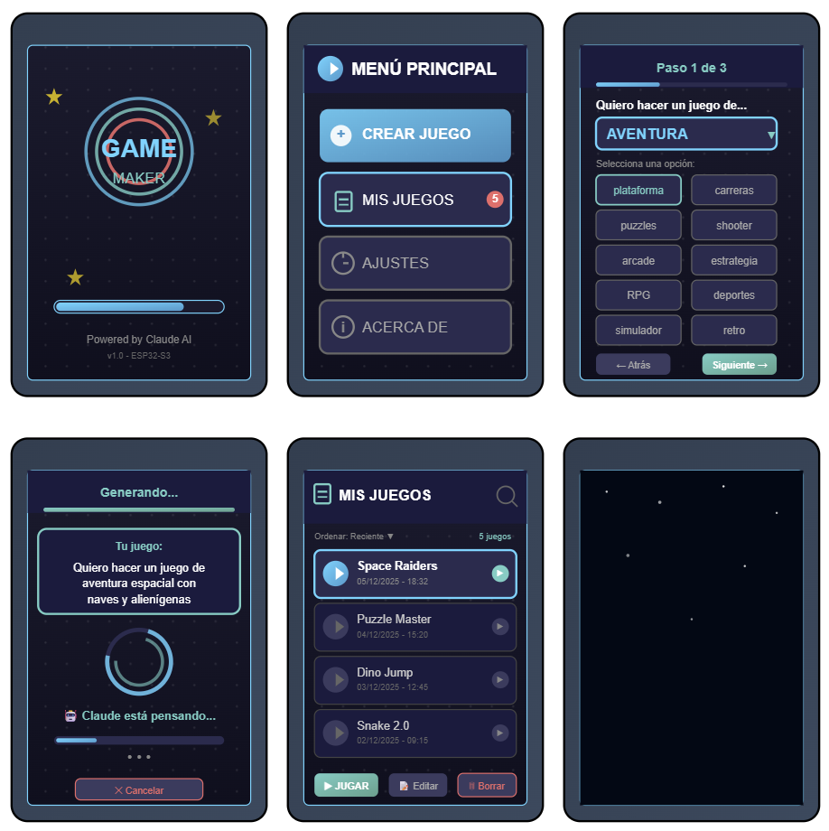
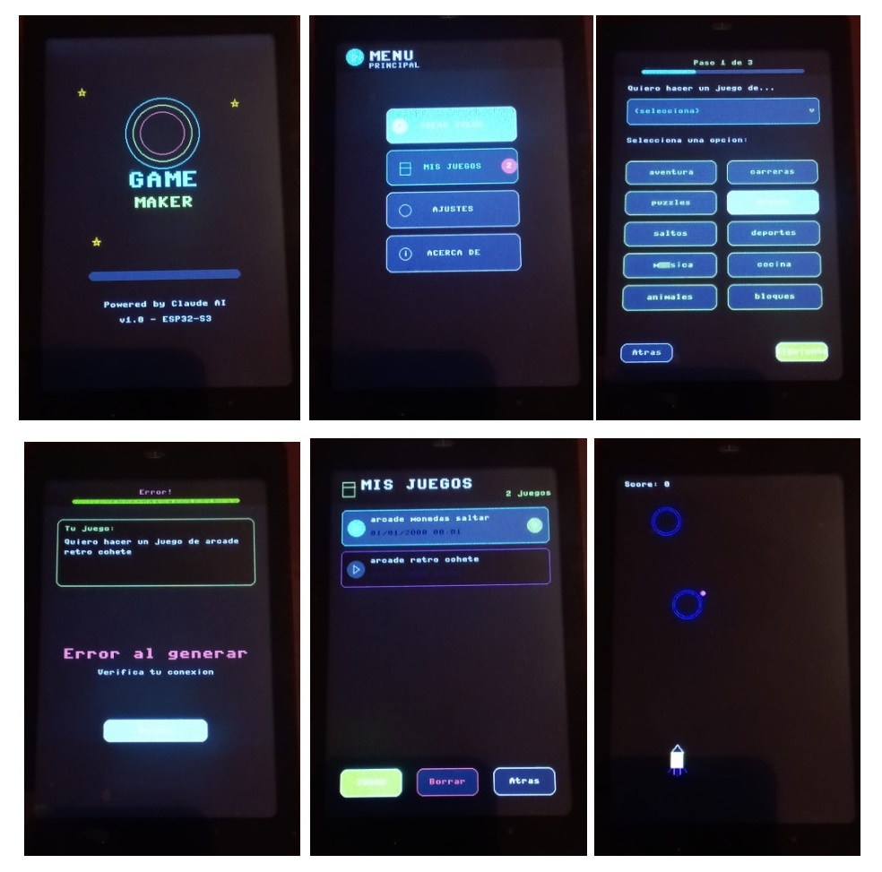
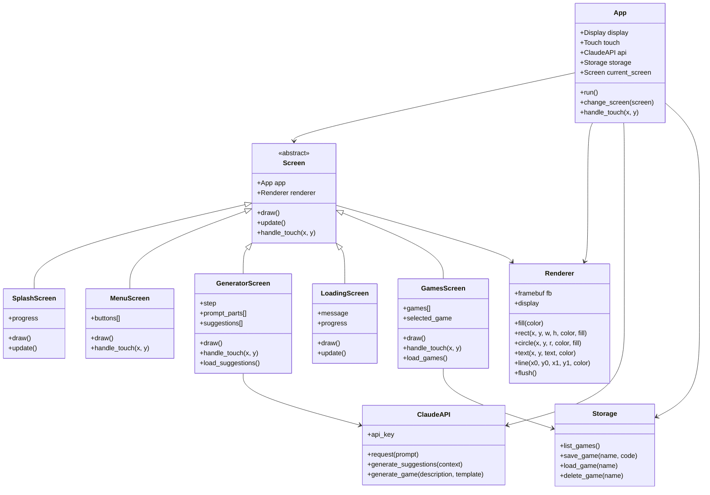
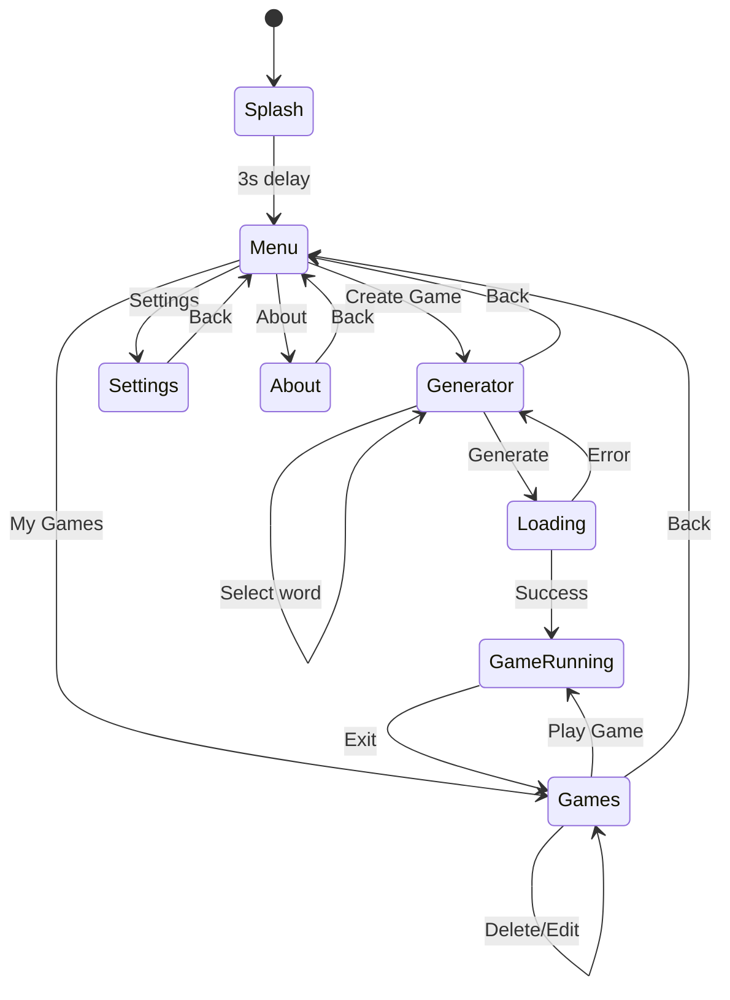
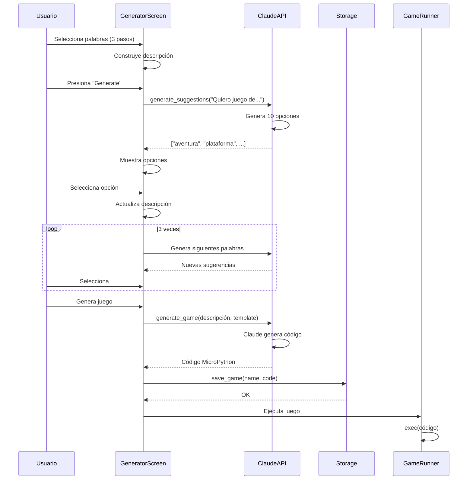

# 🎮 Game Maker Console

Consola portátil que genera sus propios juegos usando Claude AI.

## 📋 Hardware Requerido

- **ESP32-S3** con MicroPython
- **LCD TFT 320x480** ST7796S (SPI)
- **Touch Screen** FT6x36 (I2C)
- **Conexión WiFi** para API de Claude

## 🏗️ Arquitectura del Proyecto

```
game_maker/
├── main.py                # Punto de entrada
├── config.py              # Configuración de pines y WiFi
├── hal/
│   ├── st7796s.py        # Driver LCD (proporcionado)
│   └── ft6x36.py         # Driver Touch (proporcionado)
├── ui/
│   ├── screen.py         # Clase base para pantallas
│   ├── splash_screen.py  # Pantalla de inicio
│   ├── menu_screen.py    # Menú principal
│   ├── generator_screen.py # Generador de ideas
│   ├── loading_screen.py # Pantalla de carga
│   └── games_screen.py   # Explorador de juegos

├── core/
│   ├── app.py           # Controlador principal
│   ├── claude_api.py    # Cliente API de Claude
│   ├── game_runner.py   # Ejecutor de juegos
│   ├── storage.py       # Gestión de archivos
│   └── renderer.py      # Sistema de renderizado
└── games/               # Juegos generados (dinámico)
```

## 📊 Diagramas

### Diagrama de Clases



### Diagrama de Estados



### Diagrama de Secuencia - Generación de Juego



## 🚀 Guía de Uso para Niños

### 1️⃣ Enciende la Consola

Cuando enciendas tu Game Maker verás un logo genial con círculos de colores. ¡Espera 3 segundos!

### 2️⃣ Menú Principal

Verás 4 botones:
- **CREAR JUEGO** 🎨 (el grande azul) - ¡Para hacer tu juego!
- **MIS JUEGOS** 📁 - Ver juegos que ya hiciste
- **AJUSTES** ⚙️ - Configuración
- **ACERCA DE** ℹ️ - Información

### 3️⃣ Crear Tu Juego

1. Toca el botón azul grande **CREAR JUEGO**
2. Verás: "Quiero hacer un juego de..."
3. Te mostrará 10 palabras para elegir, por ejemplo:
   - aventura
   - plataforma
   - carreras
   - puzzles
   - arcade
   
4. **Toca una palabra** (por ejemplo: "aventura")
5. Ahora te preguntará más cosas, elige 2 palabras más
6. Al final dirás algo como: "Quiero hacer un juego de aventura espacial con aliens"

### 4️⃣ ¡Claude Crea Tu Juego!

1. Toca el botón verde **GENERATE** ✨
2. Verás círculos girando - ¡Claude está pensando!
3. Espera 10-30 segundos
4. ¡Tu juego aparecerá automáticamente!

### 5️⃣ Jugar Tus Juegos

1. Desde el menú, toca **MIS JUEGOS**
2. Verás una lista de todos tus juegos
3. Toca uno para seleccionarlo
4. Toca el botón verde **▶ JUGAR**
5. ¡A jugar!

### 6️⃣ Borrar Juegos

1. En **MIS JUEGOS**, selecciona un juego
2. Toca el botón rojo **🗑 BORRAR**
3. Confirma que quieres borrarlo

## ⚙️ Configuración

Edita `config.py` con tus datos:

```python
# WiFi
WIFI_SSID = "tu_wifi"
WIFI_PASSWORD = "tu_password"

# Claude API
CLAUDE_API_KEY = "sk-ant-..."

# Pines SPI (LCD)
SPI_SCK = 12
SPI_MOSI = 11
SPI_MISO = 13
LCD_CS = 10
LCD_DC = 9
LCD_RST = 14
LCD_BL = 8

# Pines I2C (Touch)
I2C_SDA = 6
I2C_SCL = 7
```

## 🎨 Colores Usados

- **Fondo oscuro**: `0x0000` (Negro)
- **Fondo pantalla**: `0x1082` (Azul oscuro)
- **Primario (Cyan)**: `0x07FF` (Azul brillante)
- **Secundario (Verde)**: `0x4FE6` (Verde azulado)
- **Acento (Rojo)**: `0xF986` (Rojo coral)
- **Texto**: `0xFFFF` (Blanco)
- **Texto secundario**: `0x8410` (Gris)

## 📝 Template para Claude

El sistema envía este template a Claude para generar juegos:

```python
# GAME_TEMPLATE.md
Hardware disponible:
- Display: 320x480 pixels, RGB565
- Touch: coordenadas (x, y)
- Framebuffer primitivas: pixel, line, rect, circle, text

Estructura requerida:
```python
class Game:
    def __init__(self, renderer, touch):
        self.renderer = renderer
        self.touch = touch
        # Tu inicialización
    
    def update(self):
        # Lógica del juego (llamado cada frame)
        pass
    
    def draw(self):
        # Dibuja el juego
        pass
    
    def handle_touch(self, x, y):
        # Maneja toques
        pass
```

## 🔧 Troubleshooting

**No conecta a WiFi:**
- Verifica SSID y contraseña en `config.py`
- Asegúrate que el WiFi sea 2.4GHz

**Error de API:**
- Verifica tu API key de Claude
- Comprueba conexión a internet

**Pantalla en blanco:**
- Verifica conexiones SPI
- Revisa pines en `config.py`

**Touch no responde:**
- Verifica conexiones I2C
- Calibra touch en ajustes

## 📚 Recursos Adicionales

- [Documentación MicroPython](https://docs.micropython.org/)
- [Claude API Docs](https://docs.anthropic.com/)
- [Tutoriales de juegos](https://github.com/game-maker-console)

## 🎉 ¡Diviértete Creando!

Ahora eres un creador de videojuegos. Experimenta, prueba ideas locas y ¡comparte tus creaciones!
